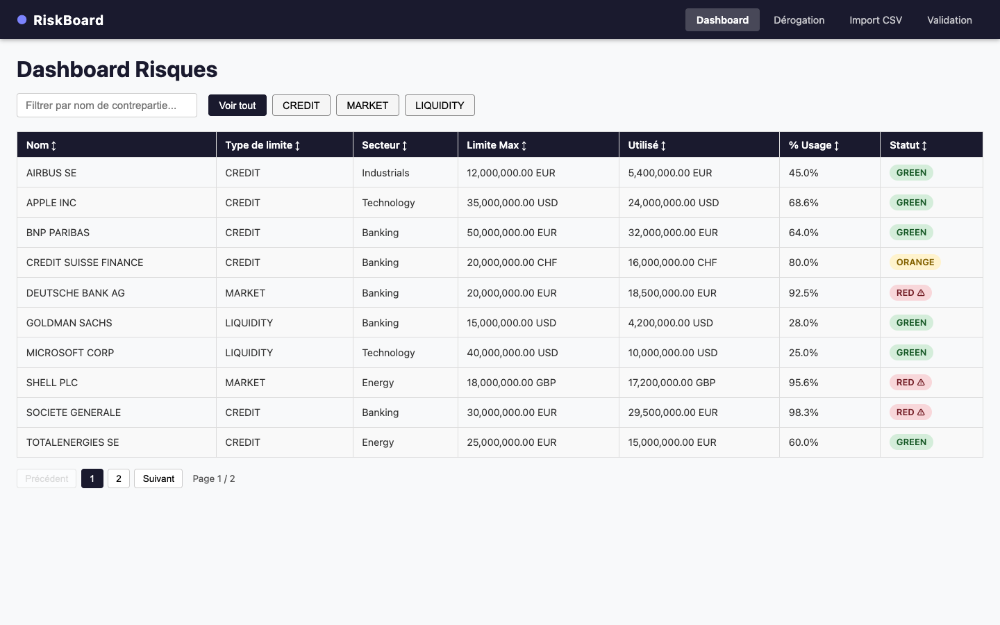
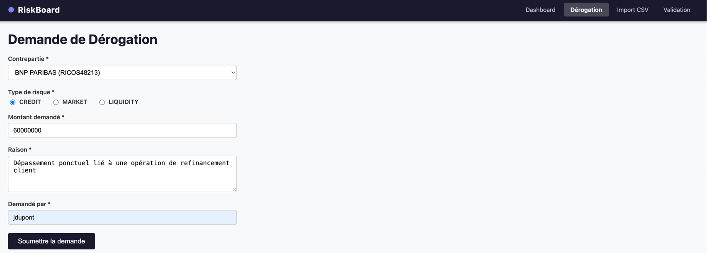
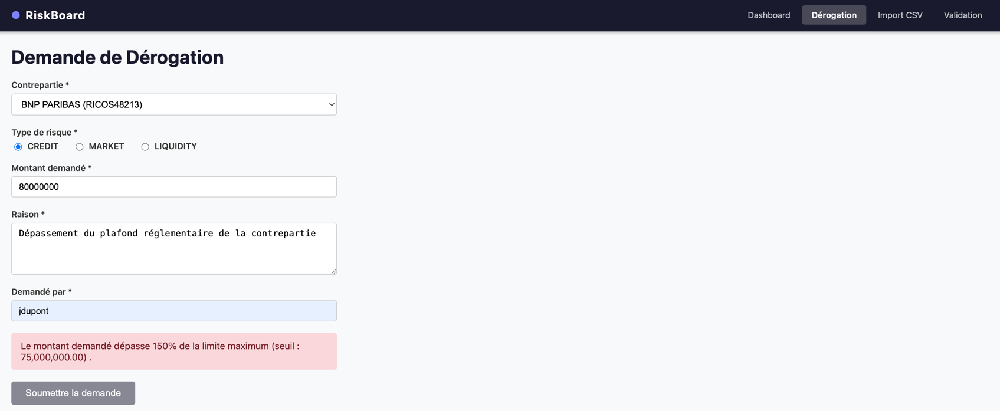
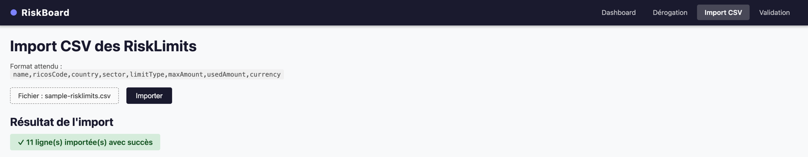
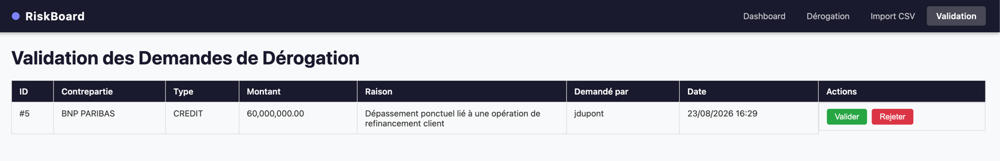
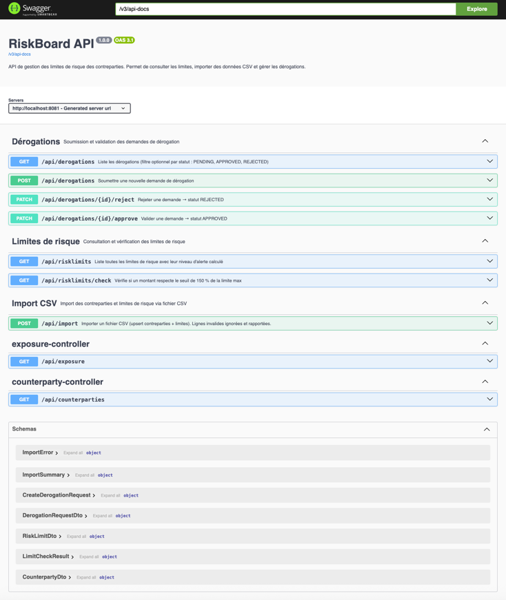

# RiskBoard

> Application de gestion des limites de risque des contreparties pour les équipes Sales d'une banque.

RiskBoard permet de consulter en temps réel l'exposition aux risques (crédit, marché, liquidité), d'importer des données via CSV et de soumettre des demandes de dérogation soumises à validation.

---

## Table des matières

1. [Stack technique](#stack-technique)
2. [Prérequis](#prérequis)
3. [Lancement avec Docker](#lancement-avec-docker-recommandé)
4. [Développement local](#développement-local)
5. [Build de production](#build-de-production)
6. [Tests](#tests)
7. [Aperçu des écrans](#aperçu-des-écrans)
8. [Import CSV](#import-csv)
9. [Swagger UI](#swagger-ui)
10. [API REST](#api-rest)
11. [Règles métier](#règles-métier)
12. [Structure du dépôt](#structure-du-dépôt)

---

## Stack technique

| Couche          | Technologie                                        |
|-----------------|----------------------------------------------------|
| Backend         | Java 21 · Spring Boot 4 · Maven 3.9               |
| ORM / Mapping   | Spring Data JPA · Hibernate · MapStruct 1.6        |
| Frontend        | Angular 22 · Angular Material                     |
| Base de données | PostgreSQL 16 (prod) · H2 in-memory (tests)       |
| Conteneurs      | Docker · Docker Compose                            |
| CI              | GitLab CI                                          |

---

## Prérequis

| Contexte | Outils requis |
|---|---|
| Lancement Docker | [Docker Desktop](https://www.docker.com/products/docker-desktop/) ≥ 24 |
| Développement backend | Java 21 (OpenJDK ou Eclipse Temurin) · Maven 3.9+ |
| Développement frontend | Node.js 24+ · npm 10+ |

---

## Lancement avec Docker (recommandé)

### 1. Cloner le dépôt

```bash
git clone <url-du-repo>
cd riskboard
```

### 2. Configurer les variables d'environnement

```bash
cp .env.example .env
# Éditer .env et renseigner DB_USERNAME et DB_PASSWORD
```

### 3. Démarrer la stack complète

```bash
docker compose up --build
```

> Le premier lancement télécharge les images et compile le backend et le frontend (~2 min).
> Les lancements suivants utilisent le cache Docker et démarrent en quelques secondes.

### 4. Accéder à l'application

| Service       | Adresse                                         | Remarque                        |
|---------------|-------------------------------------------------|---------------------------------|
| Frontend      | http://localhost:4201                           | Interface utilisateur Angular   |
| Backend       | http://localhost:8081                           | API REST                        |
| Swagger UI    | http://localhost:8081/swagger-ui.html           | Documentation interactive       |
| Spec OpenAPI  | http://localhost:8081/v3/api-docs               | JSON OpenAPI 3.1                |
| PostgreSQL    | `localhost:5433`                                | Identifiants définis dans `.env` |

> **Architecture réseau Docker**
> Le frontend ne contacte pas le backend directement.
> Toutes les requêtes API transitent par le proxy nginx embarqué dans le conteneur frontend :
> `http://localhost:4201/api/...` → `backend:8080/api/...`

### 5. Arrêter les conteneurs

```bash
docker compose down        # arrête les conteneurs, conserve les données
docker compose down -v     # arrête et supprime les volumes (repart de zéro)
```

---

## Développement local

### Profils Spring Boot

| Profil | Activé quand | Base de données |
|--------|-------------|-----------------|
| `dev` | Défaut local (aucun réglage) | PostgreSQL locale via `application-dev.yml` |
| `test` | `mvn test` automatiquement | H2 in-memory |
| `prod` | `SPRING_PROFILES_ACTIVE=prod` (Docker) | PostgreSQL via variables d'environnement |

### Backend

Le profil `dev` est activé par défaut. Il requiert une **instance PostgreSQL locale** configurée dans `backend/src/main/resources/application-dev.yml` (fichier gitignore — à créer manuellement) :

```yaml
# backend/src/main/resources/application-dev.yml
spring:
  datasource:
    url: jdbc:postgresql://localhost:5432/riskboard
    username: postgres
    password: postgres
```

> PostgreSQL local disponible via Docker : `docker run -p 5432:5432 -e POSTGRES_PASSWORD=postgres postgres:16-alpine`

```bash
cd backend
mvn spring-boot:run
```

Disponible sur **http://localhost:8080** · Swagger UI : **http://localhost:8080/swagger-ui.html**

### Frontend

```bash
cd frontend
npm install
npm start
```

Disponible sur **http://localhost:4200** avec hot-reload activé.

> En développement local, le frontend appelle le backend directement sur `http://localhost:8080`,
> configuré dans `src/environments/environment.development.ts`.

---

## Build de production

### Backend — JAR exécutable

```bash
cd backend
mvn package -DskipTests
java -jar target/riskboard-backend-1.0.0-SNAPSHOT.jar
```

### Frontend — bundle statique

```bash
cd frontend
npm run build
# Sortie : dist/frontend/browser/  (servi par nginx dans l'image Docker)
```

### Images Docker (build individuel)

```bash
docker build -t riskboard-backend ./backend
docker build -t riskboard-frontend ./frontend
```

---

## Tests

### Backend

```bash
cd backend
mvn test
```

Les tests utilisent **H2 en mémoire** — aucune dépendance externe. Les rapports Surefire sont générés dans `backend/target/surefire-reports/`.

**Cas couverts :**

| Scénario | Résultat attendu |
|----------|-----------------|
| `usageRate < 70 %` | Niveau **GREEN** |
| `70 % ≤ usageRate ≤ 90 %` | Niveau **ORANGE** |
| `usageRate > 90 %` | Niveau **RED** |
| Agrégation `usedAmount` par secteur | `Map<String, BigDecimal>` correct |
| Import CSV — lignes valides | `successCount` incrémenté |
| Import CSV — lignes invalides | Ignorées, détaillées dans `errors` |

### Frontend

```bash
cd frontend
npm test                                               # mode watch
npm test -- --watch=false --browsers=ChromeHeadless   # exécution unique (CI)
```

---

## Aperçu des écrans

### Dashboard des risques



Vue d'ensemble de toutes les contreparties et de leurs limites de risque. Chaque ligne affiche :
- Nom · Type de limite · Secteur · Limite max · Montant utilisé · % Usage
- Un **badge de statut coloré** : `GREEN` vert / `ORANGE` orange / `RED` rouge avec icône d'alerte

**Fonctionnalités interactives :**
- Filtre en temps réel par nom de contrepartie
- Tri croissant/décroissant sur chaque colonne (tri multi-critères par défaut)
- Boutons **CREDIT / MARKET / LIQUIDITY** : bascule vers une vue agrégée par secteur (somme des montants utilisés)
- Pagination côté client

---

### Formulaire de dérogation — demande valide



Formulaire rempli avec une demande dans les limites autorisées : contrepartie **BNP PARIBAS**, type **CREDIT**, montant **60 000 000 EUR** (inférieur au seuil de 75 000 000). Le validator asynchrone a interrogé le backend et confirmé la validité — le bouton **Soumettre** est actif.

---

### Formulaire de dérogation — dépassement du seuil 150 %



Même formulaire avec le montant porté à **80 000 000 EUR**. La limite max de BNP PARIBAS en CREDIT est de 50 000 000 EUR, ce qui donne un seuil à 150 % de **75 000 000 EUR**.

Dès que le champ perd le focus, le validator asynchrone appelle `GET /api/risklimits/check` et retourne une erreur. Le message s'affiche **en temps réel** et le bouton **Soumettre** reste grisé jusqu'à ce que le montant soit corrigé.

---

### Import CSV — résultat d'import



Résultat après import du fichier `sample-risklimits.csv` : **11 lignes importées avec succès**. L'opération est un **upsert** — une contrepartie déjà existante (même `ricosCode`) est mise à jour plutôt que dupliquée. Les lignes en erreur sont ignorées et rapportées individuellement sans bloquer l'import des autres.

---

### Validation des demandes de dérogation



Liste des demandes en statut **PENDING**. Le validateur peut :
- Cliquer **Valider** → passe la demande en `APPROVED`
- Cliquer **Rejeter** → passe la demande en `REJECTED`

La liste se rafraîchit automatiquement après chaque action.

---

## Import CSV

**Endpoint :** `POST /api/import` · `multipart/form-data` · champ : `file`

### Format attendu

```
name,ricosCode,country,sector,limitType,maxAmount,usedAmount,currency
BNP Paribas,RICOS48213,France,Banking,CREDIT,50000000,32000000,EUR
Deutsche Bank,RICOS72905,Germany,Banking,MARKET,20000000,18500000,EUR
```

| Colonne | Type | Contrainte |
|---------|------|------------|
| `name` | texte | Nom de la contrepartie |
| `ricosCode` | texte | **Clé d'upsert** — doit être unique |
| `country` | texte | Pays (code ISO ou nom) |
| `sector` | texte | Secteur d'activité |
| `limitType` | enum | `CREDIT`, `MARKET` ou `LIQUIDITY` |
| `maxAmount` | décimal | Limite maximale (> 0) |
| `usedAmount` | décimal | Montant utilisé (≥ 0) |
| `currency` | texte | Code devise (ex. `EUR`, `USD`) |

> La première ligne (en-tête) est ignorée automatiquement.

### Réponse

```json
{
  "successCount": 9,
  "errorCount": 2,
  "errors": [
    { "lineNumber": 4, "message": "limitType invalide : 'AUTRE'" },
    { "lineNumber": 7, "message": "maxAmount doit être > 0" }
  ]
}
```

### Exemple avec curl

```bash
# Développement local
curl -X POST http://localhost:8080/api/import \
  -F "file=@backend/src/test/resources/sample-risklimits.csv"

# Via Docker (proxy nginx)
curl -X POST http://localhost:4201/api/import \
  -F "file=@backend/src/test/resources/sample-risklimits.csv"
```

Un fichier de référence (11 contreparties) est disponible dans `backend/src/test/resources/sample-risklimits.csv`.

---

## Swagger UI



La documentation interactive de l'API est générée automatiquement par **SpringDoc OpenAPI**.
Tous les endpoints sont regroupés par domaine métier avec leur description, les paramètres attendus et les schémas de réponse.

| URL | Description |
|-----|-------------|
| `http://localhost:8081/swagger-ui.html` | Interface graphique interactive |
| `http://localhost:8081/v3/api-docs` | Spécification OpenAPI 3.1 (JSON) |

> En mode Docker, le backend est accessible directement sur le port 8081 (non proxifié par nginx).

---

## API REST

> **Base URL**
> - Développement local : `http://localhost:8080`
> - Docker (via proxy nginx) : `http://localhost:4201`

### Contreparties

| Méthode | Endpoint | Description |
|---------|----------|-------------|
| `GET` | `/api/counterparties` | Liste toutes les contreparties |

### Limites de risque

| Méthode | Endpoint | Description |
|---------|----------|-------------|
| `GET` | `/api/risklimits` | Liste toutes les limites de risque |
| `GET` | `/api/risklimits/check` | Vérifie si un montant respecte le seuil 150 % |

Paramètres de `/api/risklimits/check` :

| Paramètre | Type | Description |
|-----------|------|-------------|
| `counterpartyId` | Long | Identifiant de la contrepartie |
| `limitType` | enum | `CREDIT`, `MARKET` ou `LIQUIDITY` |
| `amount` | BigDecimal | Montant à vérifier |

### Import

| Méthode | Endpoint | Description |
|---------|----------|-------------|
| `POST` | `/api/import` | Import CSV en `multipart/form-data` |

### Dérogations

| Méthode | Endpoint | Description |
|---------|----------|-------------|
| `GET` | `/api/derogations/pending` | Liste les demandes en attente (`PENDING`) |
| `POST` | `/api/derogations` | Soumettre une nouvelle demande |
| `POST` | `/api/derogations/{id}/approve` | Valider une demande (→ `APPROVED`) |
| `POST` | `/api/derogations/{id}/reject` | Rejeter une demande (→ `REJECTED`) |

### Exemple — créer une dérogation

```bash
curl -X POST http://localhost:4201/api/derogations \
  -H "Content-Type: application/json" \
  -d '{
    "counterpartyId": 1,
    "limitType": "CREDIT",
    "amount": 60000000,
    "reason": "Besoin de financement exceptionnel pour acquisition strategique.",
    "requestedBy": "jean.dupont"
  }'
```

---

## Règles métier

### Niveaux d'alerte

```
usageRate = (usedAmount / maxAmount) × 100
```

| Taux d'utilisation | Niveau | Badge |
|--------------------|--------|-------|
| `< 70 %` | GREEN | Vert |
| `70 % ≤ taux ≤ 90 %` | ORANGE | Orange |
| `> 90 %` | RED | Rouge + icône d'alerte |

> Les bornes **70** et **90** sont incluses dans le niveau **ORANGE**.

### Dérogation

| Règle | Détail |
|-------|--------|
| Seuil maximum | Le montant demandé ne peut pas dépasser **150 % de la limite max** |
| Prérequis | Une limite doit exister pour la contrepartie **et** le type de risque choisi |
| Cycle de vie | `PENDING` → `APPROVED` ou `REJECTED` (action manuelle du validateur) |

---

## Structure du dépôt

```
riskboard/
├── backend/                          # Spring Boot (Maven)
│   ├── src/
│   │   ├── main/java/com/riskboard/
│   │   │   ├── controller/           # REST controllers
│   │   │   ├── service/              # Logique métier
│   │   │   ├── repository/           # Spring Data JPA
│   │   │   ├── entity/               # Entités JPA (Lombok)
│   │   │   ├── dto/                  # Objets de transfert API
│   │   │   ├── mapper/               # MapStruct mappers
│   │   │   ├── enums/                # LimitType · AlertLevel · DerogationStatus
│   │   │   ├── exception/            # GlobalExceptionHandler
│   │   │   └── config/               # CORS · OpenApiConfig
│   │   └── test/
│   │       ├── java/                 # Tests JUnit 5
│   │       └── resources/
│   │           └── sample-risklimits.csv
│   ├── Dockerfile
│   ├── .dockerignore
│   └── pom.xml
├── frontend/                         # Angular 22
│   ├── src/app/
│   │   ├── components/               # Dashboard · Dérogation · Import · Validation
│   │   ├── services/                 # Clients HTTP typés
│   │   ├── models/                   # Interfaces TypeScript (DTOs)
│   │   └── environments/             # URLs API par environnement
│   ├── Dockerfile
│   ├── .dockerignore
│   ├── nginx.conf                    # Proxy /api/ → backend + SPA fallback
│   └── package.json
├── docs/
│   ├── screenshots/                  # Captures d'écran du README
│   └── CHOIX_TECHNIQUES.md          # Argumentaire technique (entretien)
├── docker-compose.yml
├── .env.example                      # Template des variables d'environnement
├── .gitlab-ci.yml
├── .gitignore
├── README.md
└── TODO.md
```
